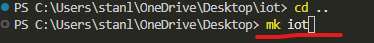
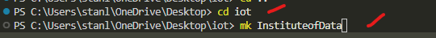
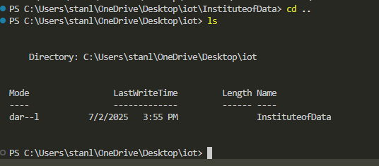
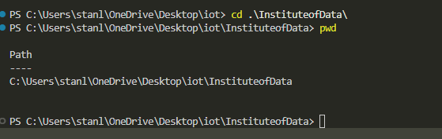
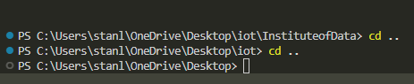
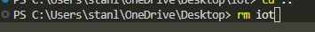

# Lab 1 
## Practice using the commands you learnt to solve the following:

>1) Create a new folder

>2) Create another folder inside the first one (create InstitudeofData folder inside iot) this folder will be initialize as a repository to my github

>3) Print the contents of the first folder (we can just use ls to list all the files that are in the current folder/directory)

>4) Change directory to the second folder, and print the current path

>5) Change directory back to the original starting place

>6) Delete the first folder

